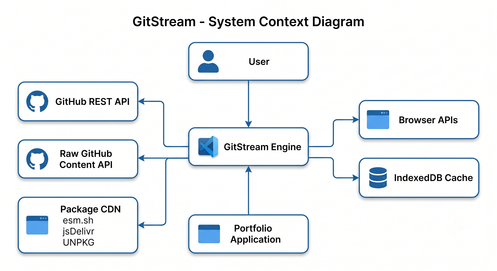
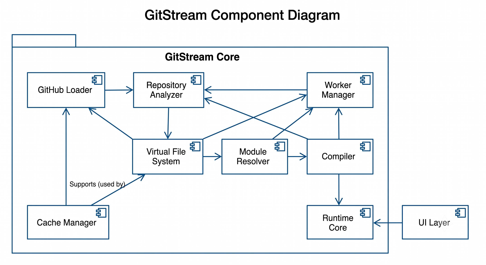

# GitStream High-Level Design (HLD)

**Project:** GitStream  
**Version:** 1.1  
**Document Type:** High-Level Design (HLD)  
**Author:** Samrat Chauhan  
**Status:** Draft

---

# Table of Contents

1. Purpose
2. Design Goals
3. System Context
4. Architectural Style
5. Container Architecture
6. Component Architecture
7. Data Flow
8. Runtime Lifecycle
9. Package Dependencies
10. Technology Stack
11. Deployment Architecture
12. Design Decisions
13. Future Extensions
14. Next Steps

---

# 1. Purpose

This document defines the overall architecture of GitStream.

It describes the major subsystems, their responsibilities, communication flow, architectural boundaries, and interactions between components.

Implementation details are intentionally excluded and are documented in the Low-Level Design (LLD).

---

# 2. Design Goals

GitStream is designed with the following principles:

- Browser-first execution
- No traditional backend
- Modular architecture
- Separation of concerns
- Independent packages
- Secure sandbox execution
- Extensible runtime
- High maintainability
- Reusable execution engine

---

# 3. System Context

The System Context Diagram illustrates how GitStream interacts with external actors and systems.

### Responsibilities

- Accept requests from the Portfolio application
- Retrieve repositories from GitHub
- Download third-party packages
- Use browser APIs for execution
- Persist cache using IndexedDB

### Diagram

---

# 4. Architectural Style

GitStream follows a layered architecture.

Layers:

1. Presentation Layer
2. Runtime Layer
3. Compilation Layer
4. Analysis Layer
5. Infrastructure Layer
6. External Systems

### Design Principles

- Each layer communicates only with adjacent layers.
- Lower layers never depend on higher layers.
- Components remain independently replaceable.

### Diagram

---

# 5. Container Architecture

GitStream is composed of multiple independent containers (packages).

Main containers:

- GitHub Loader
- Repository Analyzer
- Virtual File System
- Module Resolver
- Compiler
- Runtime Core
- Cache Manager
- Worker Manager
- UI Components

Each container exposes a well-defined interface and performs a single responsibility.

### Diagram

---

# 6. Component Architecture

The Component Diagram illustrates dependencies between the major runtime components.

Major components:

- GitHub Loader
- Repository Analyzer
- Virtual File System
- Module Resolver
- Compiler
- Runtime Core
- Worker Manager
- Cache Manager
- UI Layer

### Component Responsibilities

| Component | Responsibility |
|------------|----------------|
| GitHub Loader | Repository retrieval |
| Repository Analyzer | Framework & compatibility analysis |
| Virtual File System | Browser filesystem abstraction |
| Module Resolver | Dependency resolution |
| Compiler | TypeScript / JSX compilation |
| Runtime Core | Runtime lifecycle management |
| Cache Manager | Repository & bundle caching |
| Worker Manager | Background execution |
| UI Layer | Runtime interface |

### Diagram

---

# 7. Data Flow

GitStream processes repositories through a linear execution pipeline.

Flow:

Repository URL

↓

Repository Loader

↓

Repository Analyzer

↓

Virtual File System

↓

Dependency Resolver

↓

Compiler

↓

Runtime

↓

Running Application

The Data Flow Diagram illustrates movement of data between all major components.

### Diagram

---

# 8. Runtime Lifecycle

Every project follows the same execution lifecycle.

States:

- Idle
- Loading Repository
- Downloading Files
- Analyzing Repository
- Building Virtual File System
- Resolving Modules
- Compiling
- Creating Bundle
- Launching Runtime
- Running
- Disposed
- Error

### Diagram

---

# 9. Repository Execution Sequence

The sequence diagram illustrates how a repository is executed from user interaction to runtime execution.

Execution Flow:

1. User selects a repository.
2. Portfolio requests execution.
3. Repository is downloaded.
4. Repository is analyzed.
5. Virtual File System is constructed.
6. Dependencies are resolved.
7. Source code is compiled.
8. Bundle is generated.
9. Runtime launches.
10. Application executes.

### Diagram

---

# 10. Package Dependencies

GitStream is organized into independent packages.

Packages:

- github-loader
- analyzer
- virtual-fs
- resolver
- compiler
- runtime-core
- runtime-host
- cache
- workers
- shared
- ui

The dependency graph ensures:

- Low coupling
- High cohesion
- Clear package ownership

### Diagram

---

# 11. Technology Stack

## Frontend

- React
- TypeScript
- Vite
- Tailwind CSS

## Compiler

- esbuild-wasm

## Parsing

- @babel/parser

## Runtime

- iframe Sandbox
- Web Workers
- WebAssembly

## Storage

- IndexedDB

## External Services

- GitHub REST API
- GitHub Raw Content API
- esm.sh
- jsDelivr
- UNPKG

---

# 12. Deployment Architecture

GitStream is designed as a browser-native execution engine.

No dedicated backend server is required.

Execution Pipeline:

Browser

↓

GitHub

↓

Package CDN

↓

GitStream Runtime

↓

Sandboxed Application

---

# 13. Design Decisions

| Decision | Reason |
|-----------|--------|
| Browser-first architecture | Zero infrastructure |
| Layered architecture | Separation of concerns |
| Modular packages | Reusability |
| IndexedDB | Reduce GitHub API requests |
| Web Workers | Keep UI responsive |
| iframe sandbox | Secure execution |
| esbuild-wasm | Fast client-side compilation |
| TypeScript | Maintainability |

---

# 14. Future Extensions

Future versions of GitStream may support:

- WebContainers
- Plugin architecture
- Multiple frontend frameworks
- AI-powered compatibility analysis
- Runtime DevTools
- Session sharing
- Live editing
- Performance profiling
- Remote package registries

---

# 15. Next Steps

After the High-Level Design, development proceeds as follows:

1. Low-Level Design (LLD)
2. Architecture Decision Records (ADR)
3. API Contracts
4. Monorepo Initialization
5. GitHub Loader
6. Virtual File System
7. Repository Analyzer
8. Module Resolver
9. Compiler
10. Runtime
11. Playground
12. Portfolio

---

# Document Summary

This document defines the high-level architecture of GitStream.

Detailed implementation, interfaces, data models, algorithms, and package internals are documented in the Low-Level Design (LLD).